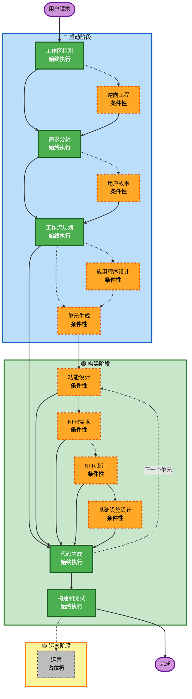

# AI-DLC 自适应工作流概述

**目的**：为AI模型和开发者提供理解完整工作流结构的技术参考。

**注意**：类似内容存在于 core-workflow.md（用户欢迎消息）和 README.md（文档）中。这种重复是有意的 - 每个文件服务于不同目的：
- **此文件**：带有Mermaid图表的详细技术参考，用于AI模型上下文加载
- **core-workflow.md**：带有ASCII图表的面向用户的欢迎消息
- **README.md**：存储库的人类可读文档

## 三阶段生命周期：
• **启动阶段**：规划和架构（工作区检测 + 条件性阶段 + 工作流规划）
• **构建阶段**：设计、实现、构建和测试（每单元设计 + 代码规划/生成 + 构建和测试）
• **运营阶段**：未来部署和监控工作流的占位符

## 自适应工作流：
• **工作区检测**（始终）→ **逆向工程**（仅棕地）→ **需求分析**（始终，自适应深度）→ **条件性阶段**（根据需要）→ **工作流规划**（始终）→ **代码生成**（始终，每单元）→ **构建和测试**（始终）

## 工作原理：
• **AI分析**您的请求、工作区和复杂性以确定需要哪些阶段
• **这些阶段始终执行**：工作区检测、需求分析（自适应深度）、工作流规划、代码生成（每单元）、构建和测试
• **所有其他阶段都是条件性的**：逆向工程、用户故事、应用程序设计、单元生成、每单元设计阶段（功能设计、NFR需求、NFR设计、基础设施设计）
• **无固定序列**：阶段按对您特定任务有意义的顺序执行

## 您团队的角色：
• **回答问题**在专用问题文件中使用 [Answer]: 标签和字母选择（A、B、C、D、E）
• **选项E可用**：如果提供的选项不匹配，选择"其他"并描述您的自定义响应
• **团队合作**审查并批准每个阶段后再继续
• **集体决定**需要时的架构方法
• **重要**：这是团队努力 - 为每个阶段涉及相关利益相关者

## AI-DLC 三阶段工作流：

**阶段描述：**

**🔵 启动阶段** - 规划和架构
- 工作区检测：分析工作区状态和项目类型（始终执行）
- 逆向工程：分析现有代码库（条件性 - 仅限棕地）
- 需求分析：收集和验证需求（始终执行 - 自适应深度）
- 用户故事：创建用户故事和角色（条件性）
- 工作流规划：创建执行计划（始终执行）
- 应用程序设计：高级组件识别和服务层设计（条件性）
- 单元生成：分解为工作单元（条件性）

**🟢 构建阶段** - 设计、实现、构建和测试
- 功能设计：每单元详细业务逻辑设计（条件性，每单元）
- NFR需求：确定NFR并选择技术栈（条件性，每单元）
- NFR设计：纳入NFR模式和逻辑组件（条件性，每单元）
- 基础设施设计：映射到实际基础设施服务（条件性，每单元）
- 代码生成：生成代码，第1部分 - 规划，第2部分 - 生成（始终执行，每单元）
- 构建和测试：构建所有单元并执行全面测试（始终执行）

**🟡 运营阶段** - 占位符
- 运营：未来部署和监控工作流的占位符（占位符）

**关键原则：**
- 阶段仅在增加价值时执行
- 每个阶段独立评估
- 启动阶段专注于"什么"和"为什么"
- 构建阶段专注于"如何"加上"构建和测试"
- 运营阶段是未来扩展的占位符
- 简单变更可能跳过条件性启动阶段
- 复杂变更获得完整的启动和构建处理