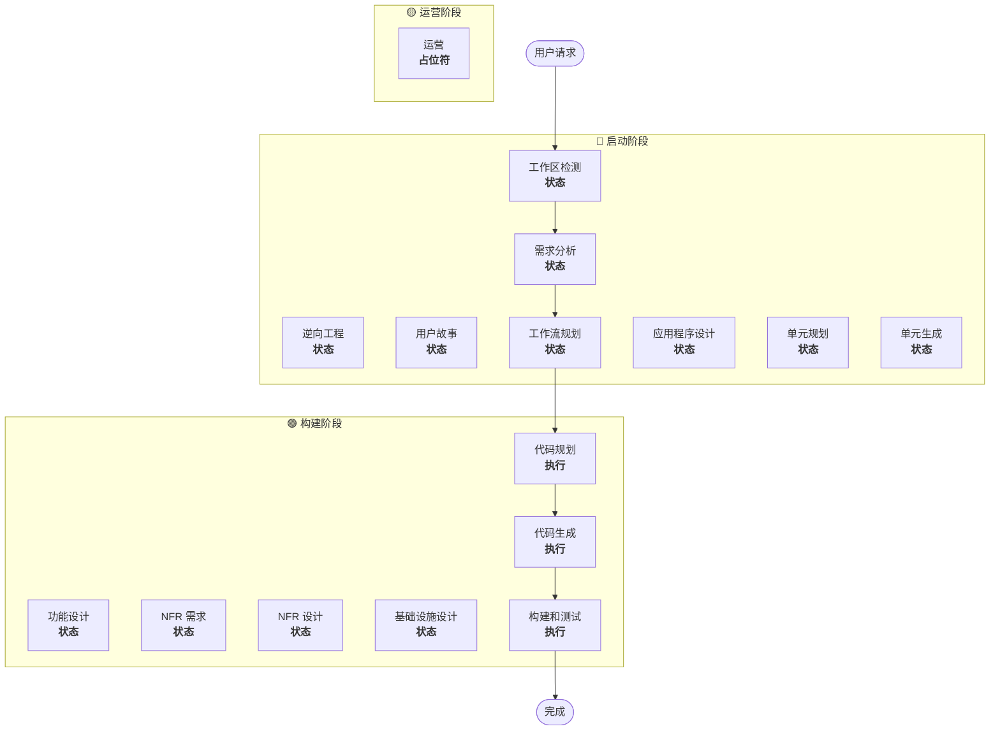

# 工作流规划

**目的**：确定要执行哪些阶段并创建全面的执行计划

**始终执行**：此阶段在理解需求和范围后始终运行

## 步骤1：加载所有先前上下文

### 1.1 加载逆向工程工件（如果是棕地项目）
- architecture.md
- component-inventory.md
- technology-stack.md
- dependencies.md

### 1.2 加载需求分析
- requirements.md（包括意图分析）
- requirement-verification-questions.md（带答案）

### 1.3 加载用户故事（如果已执行）
- stories.md
- personas.md

## 步骤2：详细范围和影响分析

**现在我们有了完整的上下文（需求+故事），执行详细分析：**

### 2.1 转换范围检测（仅限棕地项目）

**如果是棕地项目**，分析转换范围：

#### 架构转换
- **单组件变更** vs **架构转换**
- **基础设施变更** vs **应用程序变更**
- **部署模型变更**（Lambda→容器，EC2→无服务器等）

#### 相关组件识别
对于转换，识别：
- 需要更新的**基础设施代码**
- 需要变更的**CDK堆栈**
- **API网关**配置
- **负载均衡器**需求
- 需要的**网络**变更
- **监控/日志**适配

#### 跨包影响
- 需要更新的**CDK基础设施**包
- 需要版本更新的**共享模型**
- 需要端点变更的**客户端库**
- 需要新测试场景的**测试包**

### 2.2 变更影响评估

#### 影响领域
1. **面向用户的变更**：这是否影响用户体验？
2. **结构变更**：这是否改变系统架构？
3. **数据模型变更**：这是否影响数据库架构或数据结构？
4. **API变更**：这是否影响接口或合约？
5. **NFR影响**：这是否影响性能、安全或可扩展性？

#### 应用层影响（如果适用）
- **代码变更**：新入口点、适配器、配置
- **依赖关系**：新库、框架变更
- **配置**：环境变量、配置文件
- **测试**：单元测试、集成测试

#### 基础设施层影响（如果适用）
- **部署模型**：Lambda→ECS，EC2→Fargate等
- **网络**：VPC、安全组、负载均衡器
- **存储**：持久卷、共享存储
- **扩展**：自动扩展策略、容量规划

#### 运营层影响（如果适用）
- **监控**：CloudWatch、自定义指标、仪表板
- **日志**：日志聚合、结构化日志
- **告警**：告警配置、通知渠道
- **部署**：CI/CD管道变更、回滚策略

### 2.3 组件关系映射（仅限棕地项目）

**如果是棕地项目**，创建组件依赖图：

```markdown
## 组件关系
- **主要组件**：[正在变更的包]
- **基础设施组件**：[CDK/Terraform包]
- **共享组件**：[模型、工具、客户端]
- **依赖组件**：[调用此组件的服务]
- **支持组件**：[监控、日志、部署]
```

对于每个相关组件：
- **变更类型**：主要、次要、仅配置
- **变更原因**：直接依赖、部署模型、网络
- **变更优先级**：关键、重要、可选

### 2.4 风险评估

评估风险级别：
1. **低**：孤立变更，易于回滚，理解充分
2. **中等**：多个组件，中等回滚，一些未知因素
3. **高**：系统级影响，复杂回滚，重大未知因素
4. **关键**：生产关键，难以回滚，高不确定性

## 步骤 3：阶段确定

### 3.1 用户故事 - 已执行或跳过？
**已执行**：移至下一个确定
**未执行 - 执行条件**：
- 多个用户角色
- 用户体验影响
- 需要验收标准
- 需要团队协作

**跳过条件**：
- 内部重构
- 有明确重现步骤的错误修复
- 技术债务减少
- 基础设施变更

### 3.2 应用程序设计 - 执行条件：
- 需要新组件或服务
- 需要定义组件方法和业务规则
- 需要服务层设计
- 需要澄清组件依赖关系

**跳过条件**：
- 现有组件边界内的变更
- 无新组件或方法
- 纯实现变更

### 3.3 设计（单元规划/生成）- 执行条件：
- 新数据模型或架构
- API 变更或新端点
- 复杂算法或业务逻辑
- 状态管理变更
- 多个包需要变更
- 需要基础设施即代码更新

**跳过条件**：
- 简单逻辑变更
- 仅 UI 变更
- 配置更新
- 直接实现

### 3.4 NFR 实现 - 执行条件：
- 性能要求
- 安全考虑
- 可扩展性关注
- 需要监控/可观察性

**跳过条件**：
- 现有 NFR 设置足够
- 无新 NFR 要求
- 对 NFR 无影响的简单变更

## 步骤 4：注意自适应详细程度

**参见 [depth-levels.md](../common/depth-levels.md) 了解自适应深度说明**

对于将要执行的每个阶段：
- 将创建所有定义的工件
- 工件内的详细级别根据问题复杂性自适应
- 模型根据问题特征确定适当的详细程度

## 步骤 5：多模块协调分析（仅限棕地项目）

**如果是具有多个模块/包的棕地项目**，分析依赖关系并确定最佳更新策略：

### 5.1 分析模块依赖关系
- 检查构建系统依赖关系和依赖清单
- 识别构建时与运行时依赖关系
- 映射模块间的 API 合约和共享接口

### 5.2 确定更新策略
基于依赖关系分析，决定：
- **更新序列**：由于依赖关系必须首先更新哪些模块
- **并行化机会**：哪些模块可以同时更新
- **协调要求**：版本兼容性、API 合约、部署顺序
- **测试策略**：每模块与集成测试方法
- **回滚策略**：如果中途失败的恢复计划

### 5.3 记录协调计划
```markdown
## 模块更新策略
- **更新方法**：[顺序/并行/混合]
- **关键路径**：[阻塞其他更新的模块]
- **协调点**：[共享 API、基础设施、数据合约]
- **测试检查点**：[何时验证集成]
```

为每个受影响的模块识别：
- **更新优先级**：必须首先更新 vs 可以稍后更新
- **依赖约束**：它依赖什么，什么依赖它
- **变更范围**：主要（破坏性）、次要（兼容）、补丁（修复）

## 步骤 6：生成工作流可视化

创建 Mermaid 流程图显示：
- 所有阶段的序列
- 每个条件阶段的 EXECUTE 或 SKIP 决定
- 每个阶段状态的适当样式

**样式规则**（在流程图后添加）：
```
style WD fill:#4CAF50,stroke:#1B5E20,stroke-width:3px,color:#fff
style CP fill:#4CAF50,stroke:#1B5E20,stroke-width:3px,color:#fff
style CG fill:#4CAF50,stroke:#1B5E20,stroke-width:3px,color:#fff
style BT fill:#4CAF50,stroke:#1B5E20,stroke-width:3px,color:#fff
style US fill:#BDBDBD,stroke:#424242,stroke-width:2px,stroke-dasharray: 5 5,color:#000
style Start fill:#CE93D8,stroke:#6A1B9A,stroke-width:3px,color:#000
style End fill:#CE93D8,stroke:#6A1B9A,stroke-width:3px,color:#000

linkStyle default stroke:#333,stroke-width:2px
```

**样式指南**：
- 已完成/始终执行：`fill:#4CAF50,stroke:#1B5E20,stroke-width:3px,color:#fff`（Material Green 白色文本）
- 条件执行：`fill:#FFA726,stroke:#E65100,stroke-width:3px,stroke-dasharray: 5 5,color:#000`（Material Orange 黑色文本）
- 条件跳过：`fill:#BDBDBD,stroke:#424242,stroke-width:2px,stroke-dasharray: 5 5,color:#000`（Material Gray 黑色文本）
- 开始/结束：`fill:#CE93D8,stroke:#6A1B9A,stroke-width:3px,color:#000`（Material Purple 黑色文本）
- 阶段容器：使用较浅的 Material 颜色（INCEPTION：#BBDEFB，CONSTRUCTION：#C8E6C9，OPERATIONS：#FFF59D）

## 步骤 7：创建执行计划文档

创建 `aidlc-docs/inception/plans/execution-plan.md`：

```markdown
# 执行计划

## 详细分析摘要

### 转换范围（仅限棕地项目）
- **转换类型**：[单组件/架构/基础设施]
- **主要变更**：[描述]
- **相关组件**：[列表]

### 变更影响评估
- **面向用户的变更**：[是/否 - 描述]
- **结构变更**：[是/否 - 描述]
- **数据模型变更**：[是/否 - 描述]
- **API 变更**：[是/否 - 描述]
- **NFR 影响**：[是/否 - 描述]

### 组件关系（仅限棕地项目）
[组件依赖图]

### 风险评估
- **风险级别**：[低/中/高/关键]
- **回滚复杂性**：[容易/中等/困难]
- **测试复杂性**：[简单/中等/复杂]

## 工作流可视化



**注意**：用实际阶段状态（COMPLETED/SKIP/EXECUTE）替换 STATUS 占位符并应用适当的样式

## 要执行的阶段

### 🔵 启动阶段
- [x] 工作区检测（已完成）
- [x] 逆向工程（已完成/已跳过）
- [x] 需求详述（已完成）
- [x] 用户故事（已完成/已跳过）
- [x] 执行计划（进行中）
- [ ] 应用程序设计 - [执行/跳过]
  - **理由**：[为什么执行或跳过]
- [ ] 单元规划 - [执行/跳过]
  - **理由**：[为什么执行或跳过]
- [ ] 单元生成 - [执行/跳过]
  - **理由**：[为什么执行或跳过]

### 🟢 构建阶段
- [ ] 功能设计 - [执行/跳过]
  - **理由**：[为什么执行或跳过]
- [ ] NFR 需求 - [执行/跳过]
  - **理由**：[为什么执行或跳过]
- [ ] NFR 设计 - [执行/跳过]
  - **理由**：[为什么执行或跳过]
- [ ] 基础设施设计 - [执行/跳过]
  - **理由**：[为什么执行或跳过]
- [ ] 代码规划 - 执行（始终）
  - **理由**：需要实现方法
- [ ] 代码生成 - 执行（始终）
  - **理由**：需要代码实现
- [ ] 构建和测试 - 执行（始终）
  - **理由**：需要构建、测试和验证

### 🟡 运营阶段
- [ ] 运营 - 占位符
  - **理由**：未来部署和监控工作流

## 包变更序列（仅限棕地项目）
[如适用，列出带依赖关系的包更新序列]

## 预估时间线
- **总阶段数**：[数量]
- **预估持续时间**：[时间估计]

## 成功标准
- **主要目标**：[主要目标]
- **关键交付物**：[列表]
- **质量门**：[列表]

[如果是棕地项目]
- **集成测试**：所有组件协同工作
- **运营就绪**：监控、日志记录、警报正常工作
```

## 步骤 8：初始化状态跟踪

更新 `aidlc-docs/aidlc-state.md`：

```markdown
# AI-DLC 状态跟踪

## 项目信息
- **项目类型**：[绿地/棕地]
- **开始日期**：[ISO 时间戳]
- **当前阶段**：启动 - 工作流规划

## 执行计划摘要
- **总阶段数**：[数量]
- **要执行的阶段**：[列表]
- **要跳过的阶段**：[带原因的列表]

## 阶段进度

### 🔵 启动阶段
- [x] 工作区检测
- [x] 逆向工程（如适用）
- [x] 需求分析
- [x] 用户故事（如适用）
- [x] 工作流规划
- [ ] 应用程序设计 - [执行/跳过]
- [ ] 单元规划 - [执行/跳过]
- [ ] 单元生成 - [执行/跳过]

### 🟢 构建阶段
- [ ] 功能设计 - [执行/跳过]
- [ ] NFR 需求 - [执行/跳过]
- [ ] NFR 设计 - [执行/跳过]
- [ ] 基础设施设计 - [执行/跳过]
- [ ] 代码规划 - 执行
- [ ] 代码生成 - 执行
- [ ] 构建和测试 - 执行

### 🟡 运营阶段
- [ ] 运营 - 占位符

## 当前状态
- **生命周期阶段**：启动
- **当前阶段**：工作流规划完成
- **下一阶段**：[要执行的下一阶段]
- **状态**：准备继续
```

## 步骤 9：向用户展示计划

```markdown
# 📋 工作流规划完成

我已基于以下内容创建了综合执行计划：
- 您的请求：[摘要]
- 现有系统：[如果是棕地项目的摘要]
- 需求：[如果已执行的摘要]
- 用户故事：[如果已执行的摘要]

**详细分析**：
- 风险级别：[级别]
- 影响：[关键影响摘要]
- 受影响的组件：[列表]

**推荐执行计划**：

我建议执行 [X] 个阶段：

🔵 **启动阶段：**
1. [阶段名称] - *理由：* [为什么执行]
2. [阶段名称] - *理由：* [为什么执行]
...

🟢 **构建阶段：**
3. [阶段名称] - *理由：* [为什么执行]
4. [阶段名称] - *理由：* [为什么执行]
...

我建议跳过 [Y] 个阶段：

🔵 **启动阶段：**
1. [阶段名称] - *理由：* [为什么跳过]
2. [阶段名称] - *理由：* [为什么跳过]
...

🟢 **构建阶段：**
3. [阶段名称] - *理由：* [为什么跳过]
4. [阶段名称] - *理由：* [为什么跳过]
...

[如果是有多个包的棕地项目]
**推荐包更新序列**：
1. [包] - [原因]
2. [包] - [原因]
...

**预估时间线**：[持续时间]

> **📋 <u>**需要审查：**</u>**  
> 请检查执行计划：`aidlc-docs/inception/plans/execution-plan.md`

> **🚀 <u>**下一步？**</u>**
>
> **您可以：**
>
> 🔧 **请求变更** - 如需要，要求修改执行计划
> [如果有任何阶段被跳过：]
> 📝 **添加跳过的阶段** - 选择包含当前标记为跳过的阶段
> ✅ **批准并继续** - 批准计划并继续到 **[下一阶段名称]**
```

## 步骤 10：处理用户响应

- **如果批准**：继续执行计划中的下一阶段
- **如果请求变更**：更新执行计划并重新确认
- **如果用户想强制包含/排除阶段**：相应更新计划

## 步骤 11：记录交互

在 `aidlc-docs/audit.md` 中记录：

```markdown
## 工作流规划 - 批准
**时间戳**：[ISO 时间戳]
**AI 提示**："准备继续执行此计划吗？"
**用户响应**："[用户的完整原始响应]"
**状态**：[已批准/请求变更]
**上下文**：已创建工作流计划，包含 [X] 个要执行的阶段

---
```
